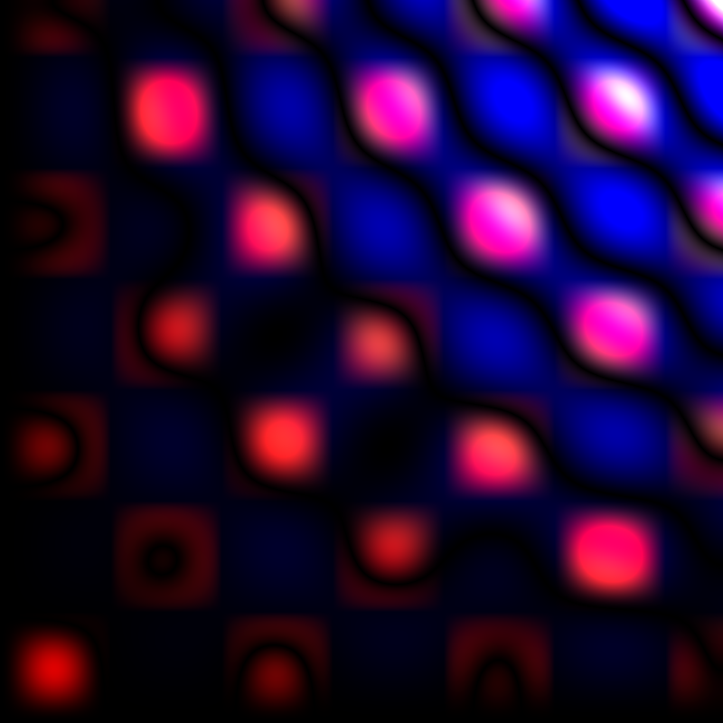
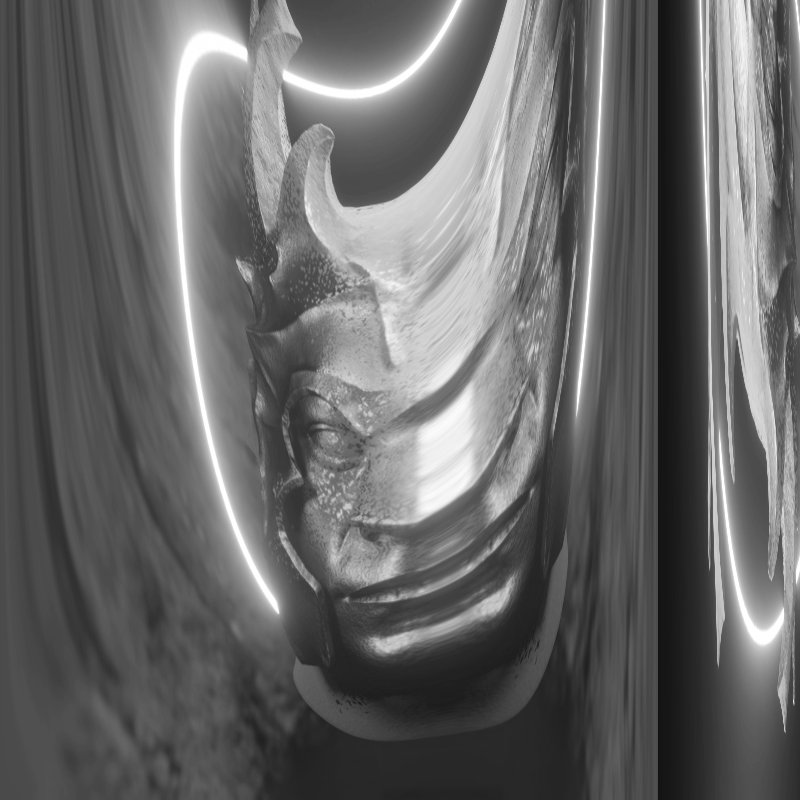
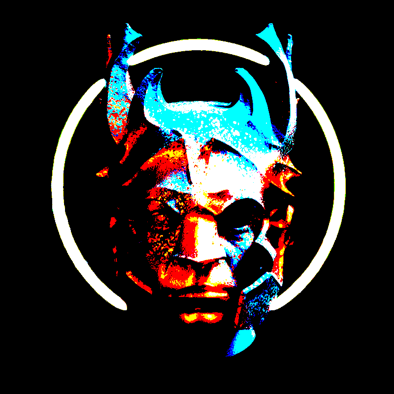
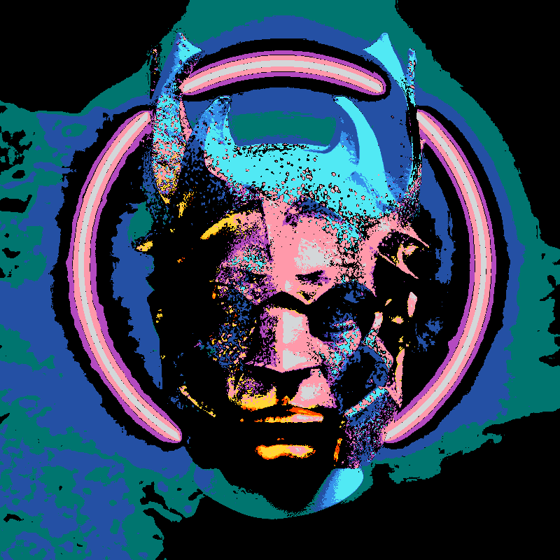
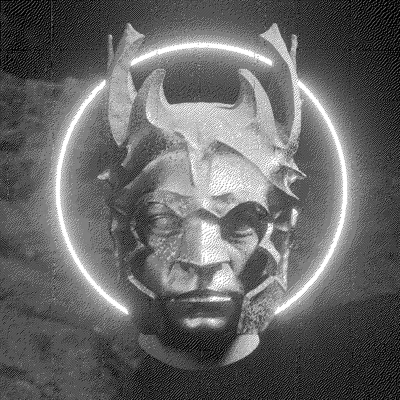
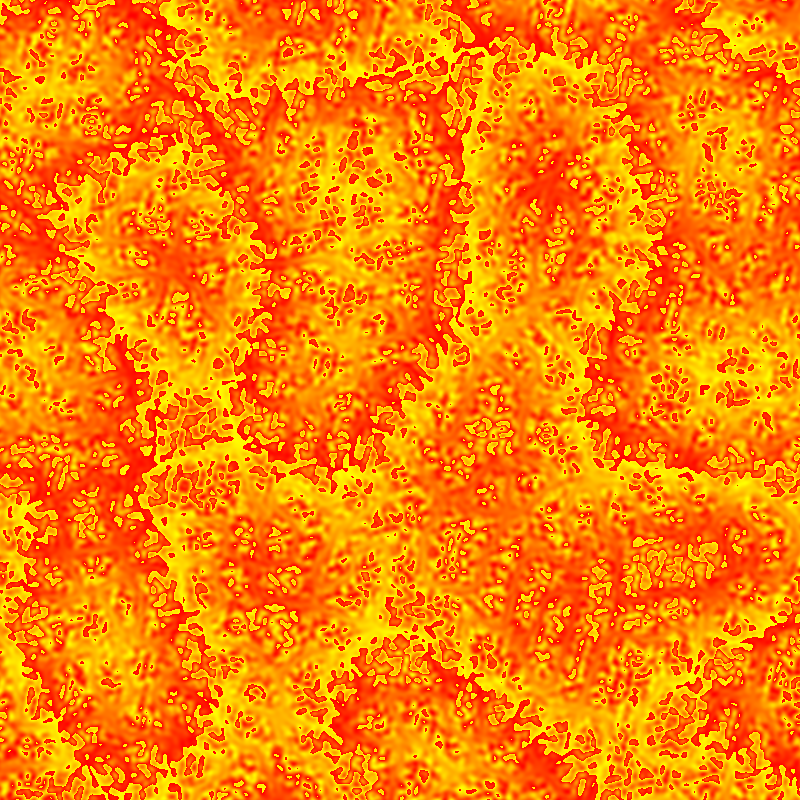

# POINTS

`POINTS` is a library that uses WebGPU and allows you to create shaders without worrying too much about the setup.

# Gallery

https://github.com/Absulit/points/assets/233719/c7c164be-7b69-4277-a80c-ce458e751966

# Examples

    
    
    
    

    
    
    
    

All examples are live here: https://absulit.github.io/points/examples/

# Main Audience

The library is for Generative Art, so in general for Creative Coders, for Programmers/Software people who like the arts, and Artists who like to code.

People who just want to create nice live graphics and use mathematics to achieve this.

There's also a strong case for people who wants to create an application that harness the power of a Compute Shader. So a Software Engineer or Mathematician who has to make heavy calculations can do it with this library.

You can code freely without the use of any of the provided [support modules (math, color, image, effects, noise, sdf, etc)](#support-modules) or you can use them and have a little bit less of code in the shader. You can of course create your own modules and import them in the same way.

# Documentation

- [Requirements](docs/requirements.md)
    - [A compatible WebGPU browser since it's currently in development](docs/requirements.md#a-compatible-webgpu-browser-since-its-currently-in-development)
    - [Syntax highlight and IDE](docs/requirements.md#syntax-highlight-and-ide)
- [Workflow](docs/workflow.md)
- [API docs](https://absulit.github.io/points/apidocs/index.html)
- [Installation](docs/installation.md)
    - [cdn (importmap)](docs/installation.md#cdn-importmap-code-examples_tutorialcdn)
    - [npm](docs/installation.md#npm-code-examples_tutorialnpm)
    - [bun](docs/installation.md#bun-code-examples_tutorialbun)
- [Code Setup](docs/code_setup.md)
- [Repository Examples](docs/repository_examples.md)
    - [index.html](docs/repository_examples.md#indexhtml)
    - [main.js](docs/repository_examples.md#mainjs)
- [RenderPass](docs/renderpass.md)
- [Create your custom Shader project](docs/create_your_custom_shader_project.md)
- [Default data available to read](docs/default_data_to_read.md)
    - [Params Uniform](docs/default_data_to_read.md#params-uniform)
    - [Parameters in vert.js that go to frag.js](docs/default_data_to_read.md#parameters-in-vertjs-that-go-to-fragjs)
        - [vert.js](docs/default_data_to_read.md#vertjs)
        - [frag.js](docs/default_data_to_read.md#fragjs)
- [Send data into the shaders](docs/send_data_into_the_shaders.md)
- [Retrieve data from the shaders](docs/retrieve_data_from_the_shaders.md)
- [UV Coordinates and Textures Considerations](docs/uv_coordinates_and_textures_considerations.md)
- [Support Modules](docs/support_modules.md)
- [RenderPasses for Post Processing](docs/render_passes_and_post_processing.md)
- [Legacy folder (original project)](docs/legacy_folder.md)

# Collaborators

[@juulio](https://github.com/juulio)
- Documentation testing
- Verifying installation is understandable
