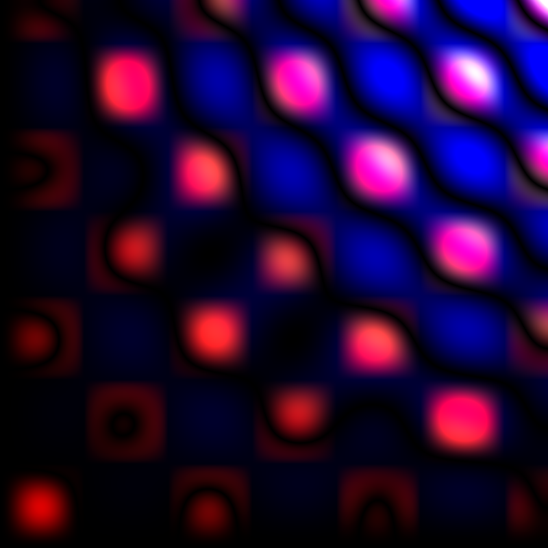
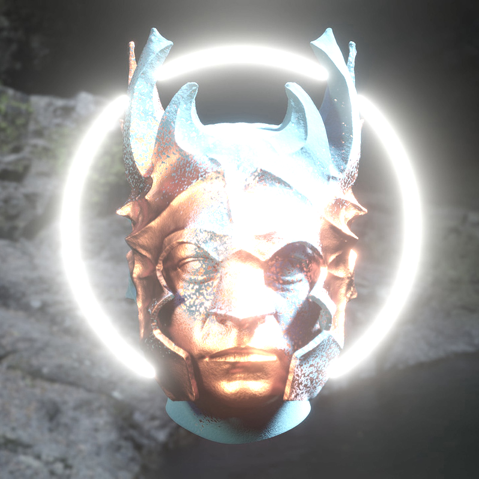
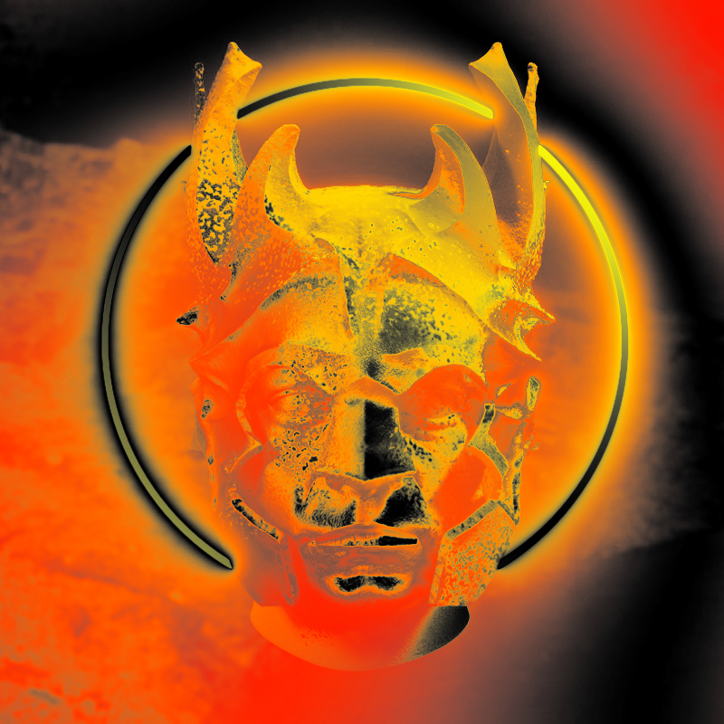
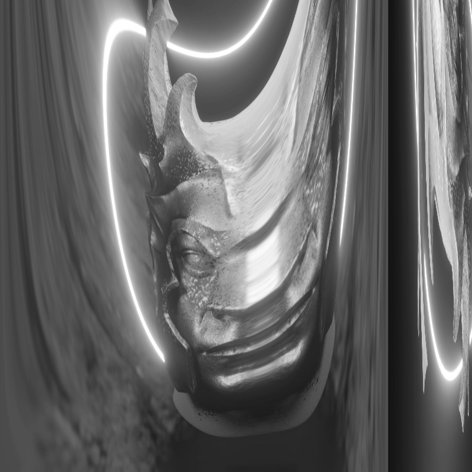
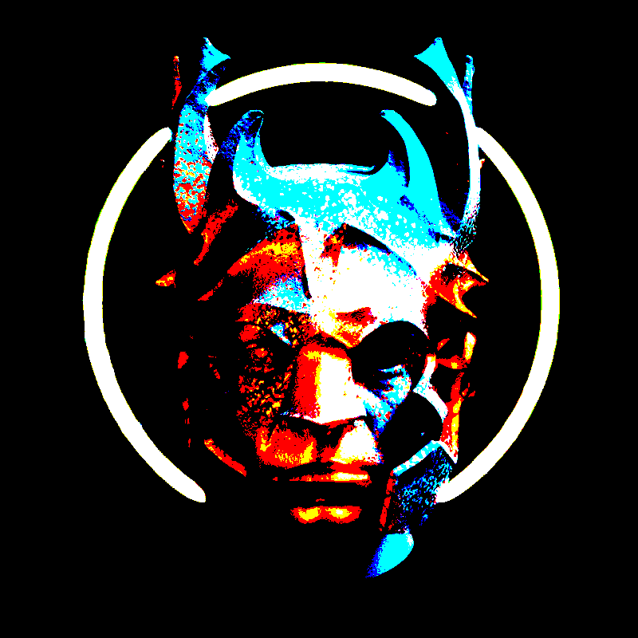
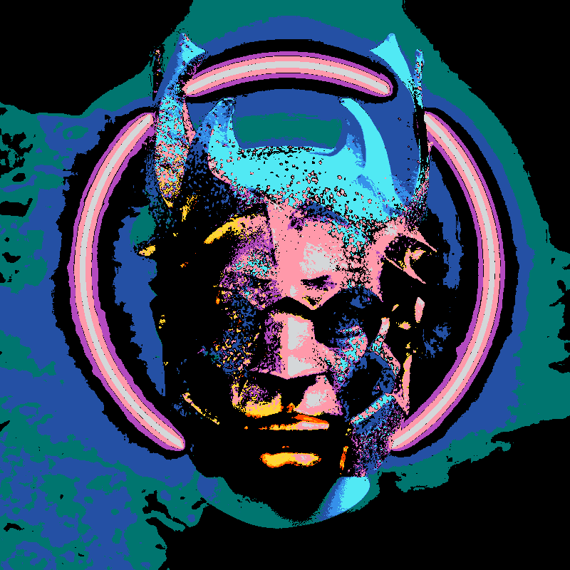
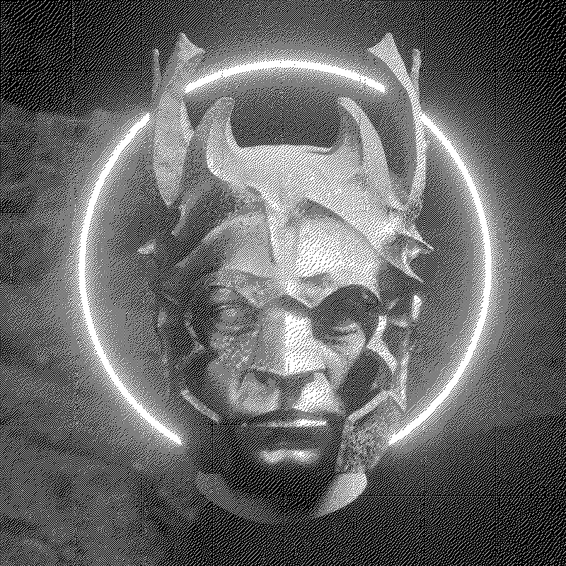
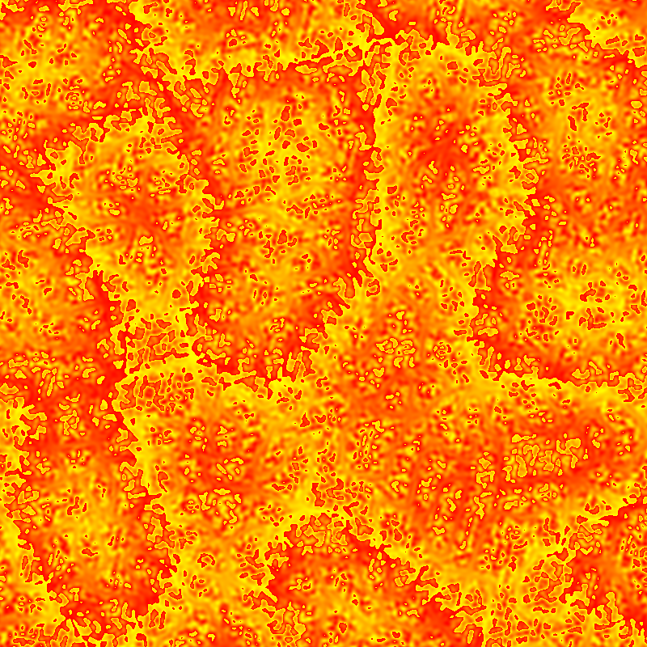

# POINTS

`POINTS` is a library that uses WebGPU and allows you to create shaders without worrying too much about the setup.

You can code freely without the use of any of the provided [support modules (math, color, image, effects, noise, sdf, etc)](#support-modules) or you can use them and have a little bit less of code in the shader. You can of course create your own modules and import them in the same way.


# Gallery

https://github.com/Absulit/points/assets/233719/c7c164be-7b69-4277-a80c-ce458e751966


# Examples

<div>
    <a href="https://absulit.github.io/points/examples/index.html#base">
        
    </a>
    <a href="https://absulit.github.io/points/examples/index.html#bloom1">
        
    </a>
    <a href="https://absulit.github.io/points/examples/index.html#imagetexture2">
        
    </a>
    <a href="https://absulit.github.io/points/examples/index.html#imagetexture3">
        
    </a>
</div>
<div>
    <a href="https://absulit.github.io/points/examples/index.html#dithering1">
        
    </a>
    <a href="https://absulit.github.io/points/examples/index.html#dithering2">
        
    </a>
    <a href="https://absulit.github.io/points/examples/index.html#dithering3_1">
        
    </a>
    <a href="https://absulit.github.io/points/examples/index.html#noise1">
        
    </a>
</div>

All examples are live here: https://absulit.github.io/points/examples/

# Main Audience

The library is for Generative Art, so in general for Creative Coders, for Programmers/Software people who like the arts, and Artists who like to code.

People who just want to create nice live graphics and use mathematics to achieve this.

# Requirements

## A compatible WebGPU browser since it's currently in development

Currently working on Chrome 113 (Windows and Mac tested)

There's progress on Firefox Nightly but not all is working yet.

WebGPU API reference (JavaScript):
https://gpuweb.github.io/gpuweb/

WGSL reference:
https://gpuweb.github.io/gpuweb/wgsl/

## Syntax highlight and IDE

We use VSCode with [WGSL Literal](https://marketplace.visualstudio.com/items?itemName=ggsimm.wgsl-literal); if you have a different IDE with WGSL hightlight go for it.

---

> You might have noticed or will notice the modules are actually JavaScript modules and imported to vert.js, compute.js, and frag.js which are then again JavaScript files, no WGSL files. This is based on a [recommendation by Brandon Jones from Google](https://toji.github.io/webgpu-best-practices/dynamic-shader-construction.html), so we take advantage of the power of the JavaScript string interpolation, instead of creating fetch calls to import wgsl files, so we can just simply interpolate the modules in our projects. Also, there's currently no way to create or import WGSL modules in other files.
>
> The simpler route we took is just to declare a single function, struct or constant as a JavaScript export, and then import them as you do, and then interpolate the reference with the same name.

---

# Workflow

Currently, we have a workflow of data setup from JavaScript and then a RenderPass composed of 3 shaders:

JavaScript setup and Data → RenderPass (Compute Shader → Vertex Shader → Fragment Shader) → Screen Output

This data can be accessed safely in all shaders across the pipeline.

To add more shaders you need to add a new RenderPass.

You can have a Vertex + Fragment shaders without a Compute shader, and also a Compute shader without a Vertex + Fragment shaders, so you can have a computational shader, a visual shader, or both.

# API
Description of modules and functions here
[https://absulit.github.io/points/apidocs/](https://absulit.github.io/points/apidocs/index.html)

# Installation

[examples_tutorial](examples_tutorial) has a directory per type of installation:

### cdn (importmap) [code: examples_tutorial/cdn/](examples_tutorial/cdn/)

---

> **Note:**  "points" is the required and main library.
 The others are helper libraries for shaders but not required.

---
```html
<script type="importmap">
    {
        "imports": {
            "points": "https://cdn.jsdelivr.net/npm/@absulit/points/build/points.min.js",

            "points/animation": "https://cdn.jsdelivr.net/npm/@absulit/points/build/core/animation.min.js",
            "points/audio": "https://cdn.jsdelivr.net/npm/@absulit/points/build/core/audio.min.js",
            "points/color": "https://cdn.jsdelivr.net/npm/@absulit/points/build/core/color.min.js",
            "points/debug": "https://cdn.jsdelivr.net/npm/@absulit/points/build/core/debug.min.js",
            "points/effects": "https://cdn.jsdelivr.net/npm/@absulit/points/build/core/effects.min.js",
            "points/image": "https://cdn.jsdelivr.net/npm/@absulit/points/build/core/image.min.js",
            "points/math": "https://cdn.jsdelivr.net/npm/@absulit/points/build/core/math.min.js",
            "points/noise2d": "https://cdn.jsdelivr.net/npm/@absulit/points/build/core/noise2d.min.js",
            "points/classicnoise2d": "https://cdn.jsdelivr.net/npm/@absulit/points/build/core/classicnoise2d.min.js",
            "points/random": "https://cdn.jsdelivr.net/npm/@absulit/points/build/core/random.min.js",
            "points/sdf": "https://cdn.jsdelivr.net/npm/@absulit/points/build/core/sdf.min.js"
        }
    }
</script>

```

### npm [code: examples_tutorial/npm/](examples_tutorial/npm/)

---

> **Note:** if you copy the example directory you can just run `npm install` and `npm start`

---

1. create `index.html` and `main.js`

    Add main as module in `index.html`

```html
<script type="module" src="main.js"></script>
```

2. Install `points`
```sh
npm init

# select only one of the following two
npm i @absulit/points # npm package
npx jsr add @absulit/points # or jsr package

```

3. Add in `package.json` (so parcel can recognize the paths)

```json
{
    "alias": {
        "points": "@absulit/points/build/points.min.js",
        "points/animation": "@absulit/points/build/core/animation",
        "points/audio": "@absulit/points/build/core/audio.min.js",
        "points/color": "@absulit/points/build/core/color.min.js",
        "points/debug": "@absulit/points/build/core/debug.min.js",
        "points/effects": "@absulit/points/build/core/effects.min.js",
        "points/image": "@absulit/points/build/core/image.min.js",
        "points/math": "@absulit/points/build/core/math.min.js",
        "points/noise2d": "@absulit/points/build/core/noise2d.min.js",
        "points/classicnoise2d": "@absulit/points/build/core/classicnoise2d.min.js",
        "points/random": "@absulit/points/build/core/random.min.js",
        "points/sdf": "@absulit/points/build/core/sdf.min.js"
    }
}
```

4. Add/Create `jsconfig.json` (for intellisense)

```json
{
  "compilerOptions": {
    "baseUrl": ".",
    "paths": {
        "points": ["node_modules/@absulit/points/build/points"],
        "points/animation": ["node_modules/@absulit/points/build/core/animation"],
        "points/audio": ["node_modules/@absulit/points/build/core/audio"],
        "points/color": ["node_modules/@absulit/points/build/core/color"],
        "points/debug": ["node_modules/@absulit/points/build/core/debug"],
        "points/effects": ["node_modules/@absulit/points/build/core/effects"],
        "points/image": ["node_modules/@absulit/points/build/core/image"],
        "points/math": ["node_modules/@absulit/points/build/core/math"],
        "points/noise2d": ["node_modules/@absulit/points/build/core/noise2d"],
        "points/classicnoise2d": ["node_modules/@absulit/points/build/core/classicnoise2d"],
        "points/random": ["node_modules/@absulit/points/build/core/random"],
        "points/sdf": ["node_modules/@absulit/points/build/core/sdf"]
    }
  }
}
```

5. `Reload Window` in vscode to reload `jsconfig.json`
    - Press `Ctrl + Shift + P` > Developer: Reload Window

6. Install parcel (or any live server that is able to recognize importmaps or path aliases)

```sh
npm install --save-dev parcel
```

7. Run live server
```sh
npx parcel index.html
```

---

> **Note:** if an error shows up after running `parcel`, delete this line ` "main": "main.js",` from package.json

---


### bun [code: examples_tutorial/bun/](examples_tutorial/bun/)

---

> **Note:** if you copy the example directory you can just run `bun install` and `bun start`

---

1. create `index.html` and `main.js`

    Add main as module in `index.html`

```html
<script type="module" src="main.js"></script>
```


2. Install `points`

```sh
bun init #select blank

# select only one of the following two
bun i @absulit/points # npm package or
bun x jsr add @absulit/points # jsr package
```

3. Run server
```sh
bun index.html
```

4. Add to `tsconfig.json` (for intellisense)
```json
{
  "compilerOptions": {
    "baseUrl": ".",
    "paths": {
        "points": ["node_modules/@absulit/points/build/points.min.js"],
        "points/animation": ["node_modules/@absulit/points/build/core/animation"]
    }
  }
}
```

5. Restart server

# Code Setup

[code: examples_tutorial/cdn/main.js](examples_tutorial/cdn/main.js)


```js
// import the `Points` class

import Points, { RenderPass } from 'points';

// reference the canvas in the constructor
const points = new Points('canvas');

// create your render pass with three shaders as follow
const renderPasses = [
    new RenderPass(
        /*wgsl*/ `
            // add @vertex string
            @vertex
            fn main(
                @location(0) position: vec4f,
                @location(1) color: vec4f,
                @location(2) uv: vec2f,
                @builtin(vertex_index) vertexIndex: u32
            ) -> Fragment {
                return defaultVertexBody(position, color, uv);
            }
        `,
        /*wgsl*/`
            // add @fragment string
            @fragment
            fn main(
                @location(0) color: vec4f,
                @location(1) uv: vec2f,
                @location(2) ratio: vec2f,  // relation between params.screen.x and params.screen.y
                @location(3) uvr: vec2f,    // uv with aspect ratio corrected
                @location(4) mouse: vec2f,
                @builtin(position) position: vec4f
            ) -> @location(0) vec4f {
                return color;
            }
        `,
        /*wgsl*/`
            // add @compute string (this can be null)
        `
    )
];

// call the `POINTS` init method and then the update method
async function init(){
    await points.init(renderPasses);
    update();
}
init();

// call `points.update()` methods to render a new frame
function update() {
    points.update();
    requestAnimationFrame(update);
}
```

If the shader is running properly you should see this: [Shader Example](https://absulit.github.io/points/examples/index.html#demo_6)

# Repository Examples
These are the examples from the live demo page here: https://absulit.github.io/points/examples/. It's recommended to download the repo for this. You can also click the source button (`<>`) in the live examples

Source located at [examples/index.html](examples)

You can take a look at `/examples/main.js` and `/examples/index.html`

## index.html

```html
<canvas id="canvas" width="800" height="800">
    Oops ... your browser doesn't support the HTML5 canvas element
</canvas>
```

## main.js

```js
// import the `Points` class

import Points from 'points';

// import the base project
import base from '../examples/base/index.js';

// reference the canvas in the constructor
const points = new Points('canvas');
```

```js
async function init() {
    // the base project in composed of the 3 shaders required
    await base.init(points);
    let renderPasses = base.renderPasses || [new RenderPass(base.vert, base.compute, base.frag)]

    // we pass the array of renderPasses
    await points.init(renderPasses);

    // first call to update
    update();
}
```

```js
// call the `base.update()`, and `points.update()` methods to render a new frame
function update() {
    base.update();
    points.update();
    requestAnimationFrame(update);
}
```

```js
// call init
init();
```

# RenderPass

As shown before a `RenderPass` is a way to have a block of shaders to pass to your application pipeline and these render passes will be executed in the order you pass them in the `Points.init()` method.

```js
let renderPasses = [
    new RenderPass(vert1, frag1, compute1),
    new RenderPass(vert2, frag2, compute2)
];

// we pass the array of renderPasses
await points.init(renderPasses);
```

You can pass a Compute Shader only, or a Vertex and Fragment together only. This way you can have a Compute Shader without visual output, create calculations and return their response values, or a regular Render Pipeline without Compute Shader calculations.

There's also three extra parameters in the RenderPass, these are to dispatch the workgroups for each dimension (x, y, z):

```js
new RenderPass(vert1, frag1, compute1, 800, 800, 1);
```

# Create your custom Shader project
1. Copy the `/examples/base/` and place it where you want to store your project.
2. Rename folder.
3. Rename the project inside `base/index.js`, that's the name going to be used in the main.js import and then assigned to the shaders variable.

```js
import vert from './vert.js';
import compute from './compute.js';
import frag from './frag.js';
const base = { // <--- change the name `base` to anything
    vert,
    compute,
    frag,
    init: async points => {
        // ...
    },
    update: points => {
        // ...
    }
}

export default base; // <--- change the name `base` to anything
```

You can also do as in the renderpasses1 example, where you can define the full renderpass with the `RenderPass` class:

```js
const renderpasses1 = {
    /**
     * Render Passes expect to have an order
     */
    renderPasses: [
        new RenderPass(vert, frag, compute),
        // new RenderPass(vert2, frag2, compute2),
        // ...
    ],
    init: async points => {
        // ...
    },
    update: points => {
        // ...
    }
}

export default renderpasses1;
```

4. Change whatever you want inside `vert.js`, `compute.js`, `frag.js`.
# Default data available to read

## Params Uniform

Globally there's a uniform struct called `Params` and its instance called `params` that has a few valuable properties to read by default. These values are initialized by the `Points` class and also updated in the `Points.update()` method.

```rust
struct Params {
    time:f32,
    delta:f32,
    epoch:f32,
    screen:vec2f,
    mouse:vec2f,
    mouseClick:f32,
    mouseDown:f32,
    mouseWheel:f32,
    mouseDelta:vec2f,
}
```

| Name          | Description                               | ex. value     |
| ------------- |:-------------                             | -----:        |
| time          | seconds since the app started             | 10.11         |
| delta         | milliseconds since last rendered frame    | 0.16          |
| epoch         | seconds since jan 1st 1970 UTC            | 1674958734.777|
| screen        | pixels in x and y dimensions              |    800, 600   |
| mouse         | mouse coordinates from (0, 0) to screen   |    100, 150   |

```rust
// frag.js
// reading params in the fragment shader
let time = params.time;
```

---

## Parameters in vert.js that go to frag.js

### vert.js

The vertex shader has this set of parameters initialized in the main function: position, color, uv, vertex_index.

```rust
@vertex
fn main(
    @location(0) position: vec4<f32>,       // position of the current vertex
    @location(1) color: vec4<f32>,          // vertex color
    @location(2) uv: vec2<f32>,             // uv coordinate
    @builtin(vertex_index) VertexIndex: u32 // index of the vertex
) -> Fragment {

    return defaultVertexBody(position, color, uv);
}
```

The `defaultVertexBody` returns a `Fragment` struct that provides the parameters for `frag.js` , it adds a ratio parameter with the ratio of the width and height of the canvas, and the mouse position as a `vec2<f32>` . The mouse position is different from the `params.mouse.x` and `params.mouse.y` , but it uses its values to calculate them in the UV space. The uvr is ratio corrected, meaning that if your canvas is wider than taller, a portion of the uv will be out of bounds to mantain the aspect ratio.

```rust
// defaultStructs.js
struct Fragment {
    @builtin(position) position: vec4<f32>,
    @location(0) color: vec4<f32>,          // vertex color
    @location(1) uv: vec2<f32>,             // uv coordinate
    @location(2) ratio: vec2<f32>,          // relation between `params.screen.x` and `params.screen.y`
    @location(3) uvr: vec2<f32>,            // uv with aspect ratio corrected using `ratio`
    @location(4) mouse: vec2<f32>           // mouse coordinates normalized between 0..1
}
```

### frag.js

The parameters are then received in the same order as the `Fragment` set them up

```rust
@fragment
fn main(
        @location(0) color: vec4<f32>,
        @location(1) uv: vec2<f32>,
        @location(2) ratio: vec2<f32>,
        @location(3) uvr: vec2<f32>,
        @location(4) mouse: vec2<f32>,
        @builtin(position) position: vec4<f32>
    ) -> @location(0) vec4<f32> {

    let finalColor:vec4<f32> = vec4(1., 0., 0., 1.);

    return finalColor;
}
```

---

> **Note:** you can modify these values if you need to. Currently, I don't feel the need to add more, but this might change later.

---

# Send data into the shaders

You can call one of the following methods, you pair the data with a `key` name, and this name is the one you will reference inside the shader:

---

> **Note:** all the `set*()` methods add the variables/buffers/data into all the shaders in all `RenderPass` passes.

---

## Uniforms - setUniform

Uniforms are sent separately in the `main.js` file and they are all combined in the shaders in the struct called `params` . By default, all values are `f32` if no Struct or Type is specified in the third parameter. If values have more than one dimension (`array`, `vec2f`, `vec3f`, `vec4f`...) the data has to be send as an array. Uniforms can not be modified at runtime inside the shaders, they can only receive data from the JavaScript side.


```js
// main.js
let valueToUpdate = 10;

async function init() {
    let renderPasses = [shaders.vert, shaders.compute, shaders.frag];
    points.setUniform('myKeyName', 0); // 0 is your default value
    points.setUniform('myTestVec2', [0.2, 2.1], 'vec2f'); // array of lenght 2 as data
    points.setUniform('myTestStruct', [99, 1, 2, 3], 'MyTestStruct'); // prop value is 99 and the rest is a vec3f

    // valueToUpdate value 10
    points.setUniform('valueToUpdate', myKeyNameValue);

    // more init code
    await points.init(renderPasses);
    update();
}

function update() {
    valueToUpdate += 1;
    // updated valueToUpdate value increases on each frame
    points.setUniform('valueToUpdate', valueToUpdate);

    // more update code
    points.update();
    requestAnimationFrame(update);
}
```

```rust
// frag.js

struct MyTestStruct {
    prop: f32,
    another_prop: vec3f
}

let aValue = params.myKeyName; // 0

let bValue = params.myTestVec2; // 0.2, 2.1

let cValue1 = params.myTestStruct.prop; // 99
let cValue2 = params.myTestStruct.another_prop; // 1, 2, 3

// value is read the same way, but will vary per frame
let dValue = params.valueToUpdate;
```

## Sampler - setSampler

A sampler for textures is sometimes required, and you need to explicitly reference it.

Don't name it just `sampler` , because that's the data type inside WGSL. `POINTS` will throw an exception if you do.

A descriptor is assigned by default, if you want to sample your image in a different way, you can take a look at [GPUTextureDescriptor](https://gpuweb.github.io/gpuweb/#texture-creation) in the WGSL docs.

```js
// main.js
async function init() {
    let renderPasses = [shaders.vert, shaders.compute, shaders.frag];

    let descriptor = {
        addressModeU: 'clamp-to-edge',
        addressModeV: 'clamp-to-edge',
        magFilter: 'nearest',
        minFilter: 'nearest',
        mipmapFilter: 'nearest',
        //maxAnisotropy: 10,
    }

    points.setSampler('mySampler', descriptor);

    // more init code
    await points.init(renderPasses);
    update();
}
```

```rust
// frag.js
let rgba = textureSample(texture, mySampler, uv);
```

## Texture - setTexture2d

You can create an empty texture, which is not very useful on its own, but if you set the second parameter to true, after the Fragment Shader is printed out to screen, it saves the output value to this texture and you can use it in the next update call, so basically you can sample the value from the previous frame.

There's also a third parameter that signals the texture to only capture that RenderPass index from your list of renderPasses (if you have multiple), if you don't pass that parameter, the texture ( in this case named `feedbackTexture`) will be overwriten by the next `RenderPass`. Useful if you want to send that renderPass output texture to a future `RenderPass`.

```js
// main.js
async function init() {
    let renderPasses = [shaders.vert, shaders.compute, shaders.frag];
    points.setTexture2d('feedbackTexture', true, 0);

    // more init code
    await points.init(renderPasses);
    update();
}
```

```rust
// compute.js
let rgba = textureSampleLevel(feedbackTexture, feedbackSampler, vec2<f32>(0,0),  0.0);
```

## TextureImage - setTextureImage

With `setTextureImage` you can pass an image and sample it with the Sampler you just added.

```js
// main.js
async function init() {
    let renderPasses = [shaders.vert, shaders.compute, shaders.frag];
    // await since the resource is async we need to wait for it to be ready
    await points.setTextureImage('image', './../img/absulit_800x800.jpg');

    // more init code
    await points.init(renderPasses);
    update();
}
```

```rust
// frag.js
let startPosition = vec2(.0);
let rgbaImage = texturePosition(image, mySampler, startPosition, uv, false);
```

## Texture2dArray - setTextureImageArray

With `setTextureImageArray` you can send a list of images of the same dimensions to wgsl and access each one of them with an index.


```js
// main.js
async function init() {
    let renderPasses = [shaders.vert, shaders.compute, shaders.frag];

    const paths = ['./image1.jpg', './image2.jpg'];
    // await since the resource is async we need to wait for it to be ready
    await points.setTextureImageArray('images', paths); // texture array is named `images`

    // more init code
    await points.init(renderPasses);
    update();
}
```


```rust
// frag.js
// 0 is the index of image1.jpg, 1 is the index of image2.jpg
let image1Color = textureSample(images, aSampler, imageUV, 0);
let image2Color = textureSample(images, aSampler, imageUV, 1);
```

## Storage - setStorage

A storage is a large array with the same data type and this data can be modified at runtime inside the shaders, so in principle this is different to any other data type here where you can only send data and not modify it in the shaders, or as the uniforms where the data can only be updated from the JavaScript side. You can allocate this space and use it in the shaders and the data will remain in the next update/frame call.

Common uses:

* Store particles
* Store variables
* Store positions
* Store colors
* Store results from a heavy calculation in the compute shader


```js
// main.js
async function init() {
    let renderPasses = [shaders.vert, shaders.compute, shaders.frag];

    const numPoints = 800 * 800;
    points.setStorage('value_noise_data', `array<f32, ${numPoints}>`);
    points.setStorage('variables', 'Variable');

    // more init code
    await points.init(renderPasses);
    update();
}
```

```rust
// compute.js outside the main function in the shader

// declare struct referenced here:
// points.setStorage('variables', 1, 'Variable', 1);
struct Variable {
    isCreated:f32
}
```

```rust
// compute.js

// size greater than 1 Storage
let b = value_noise_data[0];

// size 1 Storage, you can access struct property
variables.isCreated = 1;
```

You can also add a default type instead of a custom struct in `structName`:

```js
points.setStorage('myVar', 'f32');
points.setStorage('myVar2', 'vec2f');
```

## StorageMap - setStorageMap

Creates a Storage in the same way as a `setStorage` does, except it can be set with data from the start of the application.

---

> **WARNING**: `setStorage` tends to slow the application if the data to update is too big, so be aware.

---

```js
// main.js
async function init() {
    let renderPasses = [shaders.vert, shaders.compute, shaders.frag];

    points.setStorageMap('values', [1.0, 99.0], 'array<f32, 2>');

    // more init code


    // this is before any GPU calculation, so it's ok
    let data = [];
    let dataAmount = 800 * 800;
    for (let k = 0; k < dataAmount k++) {
        data.push(Math.random());
    }
    // it doesn't require size because uses the data to size it
    points.setStorageMap('rands', data, `array<f32, ${dataAmount}>`);

    await points.init(renderPasses);
    update();
}

// if the amount of data is way too large, then this is a performance bottleneck.
function update() {
    // this is a processor hog
    let data = [];
    let dataAmount = 800 * 800;
    for (let k = 0; k < dataAmount; k++) {
        data.push(Math.random());
    }
    points.setStorageMap('rands', data);

    // more update code
    points.update();
    requestAnimationFrame(update);
}
```

```rust
// compute.js

// we retrieve the 99.0 value
let c = values[1];
let randVal = rands[0]; // or any index between 0 and 800 * 800
```

## BindingTexture - setBindingTexture

If you require to send data as a texture from the Compute Shader to the Fragment shader and you do not want to use a Storage, you can use a `setBindingTexture()` , then in the compute shader a variable will exist where you can write colors to it, and in the Fragment Shader will exist a variable to read data from it.

---

> **Note:** Currently only supporting creating a write texture on Compute shader and a read texture on Fragment shader.

---


```js
// main.js
async function init() {
    let renderPasses = [shaders.vert, shaders.compute, shaders.frag];

    // First parameter goes to Compute Shader, second to Fragment Shader
    points.setBindingTexture('outputTex', 'computeTexture');

    // more init code
    await points.init(renderPasses);
    update();
}
```

```rust
// compute.js
textureStore(outputTex, vec2<u32>(0,0), vec4(1,0,0,1));
```

```rust
// frag.js
let rgba = textureSample(computeTexture, feedbackSampler, uv);
```

## Video - setTextureVideo

You can load and play a video in the same fashion as a texture. The video is updated with a new value every frame.

```js
// main.js
async function init() {
    let renderPasses = [shaders.vert, shaders.compute, shaders.frag];
    await points.setTextureVideo('video', './../assets_ignore/VIDEO0244.mp4');

    // more init code
    await points.init(renderPasses);
    update();
}
```

```rust
// frag.js
let rgbaVideo = textureSampleBaseClampToEdge(video, feedbackSampler, fract(uv));
```

## Webcam - setTextureWebcam

You can load and play a webcam in the same fashion as a texture. The webcam is updated with a new value every frame.

```js
// main.js
async function init() {
    let renderPasses = [shaders.vert, shaders.compute, shaders.frag];
    await points.setTextureWebcam('webcam');

    // more init code
    await points.init(renderPasses);
    update();
}
```

```rust
// frag.js
let rgbaWebcam = textureSampleBaseClampToEdge(webcam, feedbackSampler, fract(uv));
```

## Audio - setAudio

You can load audio and use its data for visualization.

```js
// index.js
let audio = points.setAudio('myAudio', './../../audio/cognitive_dissonance.mp3', volume, loop, false);
```


With the `myAudio` name, a `Sound` type named `myAudio` is created. In the future it will have more information but now it only has the `data` property. `data` is an `array<f32, 2048>`, but it's not completely filled with data, it's only filled up to `params.myAudioLength`, (`myAudio` used as prefix for each different audio) and then each of these values has a max of 256, so if you want something like a percentage, you have to divide the value at a certain index between 256
```rust
let audioX = audio.data[ u32(uvr.x * params.audioLength)] / 256;
```


---

> **Note:** The `points.setAudio` method returns a `new Audio` reference, you are responsible to start and stop the audio from the JavaScript side, if you require to start and stop a sound by creating a call from the shaders, please check the `Events - addEventListener` section

---

## Events - addEventListener

An event is an asynchronous message that can be send from the WGSL shaders to the JavaScript code. It works in a very similar way as to listen for a click in JavaScript or a screen resize, you call a `addEventListener`, but the parameters and its use change a bit. In the code below, the first parameter is the name of the event you , the event is fired by **you**, so this name currently has no predefined names like 'click', or 'mouse over', you have to define them and dispatch them.

The second parameter is the data (if any) that you will send from the WGSL shaders, this data is returnes as an array, so you have to acces each item by its index.

The last parameter is the amount of items in this array you are expecting. All items are `f32`.

```js
// as in examples\events1\index.js
points.addEventListener(
    'right_blink', // name of the event (and name of a storage)
    data => { // data returned after the event and callback
        console.log('---- Right Circle');
    },
    4 // size of the data to return
);
```

To fire an event you first need to declare the listener. The name used in the listener is also used as storage buffer that you can manipulate to dispatch the event.

The event has the following structure:

```rust
// as in src\core\defaultStructs.js
struct Event {
    updated: u32,
    data: array<f32>
}
```

To actully fire an event you have to do as follows:

```rust
right_blink.data[0] = 2; // some data
right_blink.data[1] = 2; // some data
right_blink.updated = 1; // update this property to something diff than `0`
```

By just simply changing the value of `updated` to a non zero, the library knows this event has been updated, and will dispatch the event immediately in JavaScript, so the `console.log` will print the text in the JavaScript Console. `updated` will be set as zero in the next frame, and if not updated the library then knows it doesn't have to do anything.


## Layers - setLayers

A layer is basically a Storage but pre-made with the exact same dimension of the canvas, this for potentially create multi-layered effects that require a type of temporary storage and swap values between them. All items are `vec4<f32>`

To access a layer the first bracket of the array is the layer index and the second is the index of the `vec4<f32>` item you want to access.

```js
// main.js
async function init() {
    let renderPasses = [shaders.vert, shaders.compute, shaders.frag];
    points.setLayers(2);

    // more init code
    await points.init(renderPasses);
    update();
}
```

```rust
// compute.js

let point = layers[layerIndex][itemIndex];
```

## Increase mesh resolution - setMeshDensity

By default the screen is covered by only two triangles. To display 2d data like the shaders do you don't need a lot of triangles, but if you want to make an effect that manipulates the triangles via `vert.js` you can increase the resolution of the mesh by calling `setMeshDensity` . The following example shows how to increase the mesh density, and `vert.js` manipulates its vertices.

```js
// check example/mesh1
shaders = mesh1;
points.setMeshDensity(20, 20);
```


# Retrieve data from the shaders

You can send and retrieve data from the shaders the following way:

First declare a storage as in `examples/data1/index.js`

```js
// the last parameter as `true` means you will use this `Storage` to read back
points.setStorage('resultMatrix', 'Matrix', true);
```

Read the data back after modification

```js
let result = await points.readStorage('resultMatrix');
console.log(result);
```

# UV Coordinates and Textures Considerations

Textures as images, video and webcam are vertically flipped, this is part of the WebGPU spec. The coordinate system is UV, where the origin is bottom left. The library uses UV for almost everything, and if there's a function that is not following this spec it will later. So all ranges go from 0..1, origin (0, 0) being bottom left, and 1, 1 being top right.

If you load your image and is not showing, it's probably beyond the bottom left.

A function was created to flip the image and place it in the right coordinate in the UV space, this function is called `texturePosition` and you can take a look at how it works in `examples/imagetexture1/frag.js` where it works as a `textureSample` function on steroids, just to fix the coordinates and crop it.

# Support Modules

The Support Modules are not something that you entirely need but it offers a set of functions that you might find useful and that you will find all over the [/examples](/examples/) directory. The modules have WGSL code snippets wrapped in a JavaScript export string constant that you can embed in the shader string.

| Name          | Description                               |
| ------------- |:-------------                             |
| animation.js  | Functions that use sine and `params.time` to increase and decrease a value over time             |
| cellular2d.js | Cellular noise based on work by Stefan Gustavson (link in file)             |
| classicnoise2d.js | Classic Perlin noise based on work by Stefan Gustavson (link in file)             |
| color.js | Color constants and functions that work with a color (vec4<f32>) input             |
| debug.js | Functions that show a cross (useful for mouse position) and a frame (useful to show frame border)             |
| defaultConstants.js | Currently it has nothing but it will have default constants for `POINTS` |
| defaultFunctions.js | Default functions for `POINTS` |
| defaultStructs.js | Default structs used in `POINTS` |
| defaultVertexStructs.js | Legacy code (will be removed)             |
| effects.js | Functions used for more elaborate effects like blur             |
| image.js | Functions that work over a texture like pixelation or sprites             |
| math.js | A few constants like PI and E and a couple of functions for now             |
| noise2d.js | Noise based on the work by Ian McEwan, Ashima Arts             |
| sdf.js | A few sdf functions             |
| valuenoise.js | // currently not working             |
| voronoi.js | Function to create a voronoi like output             |

You might want to take a look at each of the files and what they can offer:

These are still a WIP so expect changes

## How to use them

```js
// /src/core/math.js
export const PI = /*wgsl*/ `const PI = 3.14159265;`;
```

```js
// /examples/bloom`/frag.js
import {
    PI
} from '../../src/core/math.js';

// more js code

const frag = /*wgsl*/ `

// more wgsl code

${PI}

// more wgsl code

`;

export default frag;
```

# RenderPasses for Post Processing

You can already add render passes for postprocessing, you should add a new render pass as discussed in the [RenderPass](#renderpass) section, but you can also use a set of predefined renderpasses already included in the library to add a Post Processing effect by just adding a line of code. The RenderPasses2 demo has the 9 already included render passes running all at once with a few parameter:

```js
RenderPasses.grayscale(points);
RenderPasses.chromaticAberration(points, .02);
RenderPasses.color(points, .5, 1, 0, 1, .5);
RenderPasses.pixelate(points, 10, 10);
RenderPasses.lensDistortion(points, .4, .01);
RenderPasses.filmgrain(points);
RenderPasses.bloom(points, .5);
RenderPasses.blur(points, 100, 100, .4, 0, 0.0);
RenderPasses.waves(points, .05, .03);
```

The render pass takes the output from your already defined shaders as a Texture and then applies a process to create an effect. It takes a few assumptions to work interchangeably between them or in a layered way, this by using the same name for the output texture and input texture.

Also because JavaScript wraps and hides all of this process, I think it's better for you in the long run to just study and extract the postprocessing render pass and include it in your own render passes. Currently adding all 9 render passes seems to have no effect in the framerate, but this could be different in a larger project, so customizing your render passes is better.

# Collaborators

[@juulio](https://github.com/juulio)
- Documentation testing
- Verifying installation is understandable

# Legacy folder (original project)

The project was originally a grid made in JavaScript with a bit of WebGL but it's very slow, it still has value so it's stored in the Legacy folder. It's now used as reference for effects and is also useful for learning purposes.
