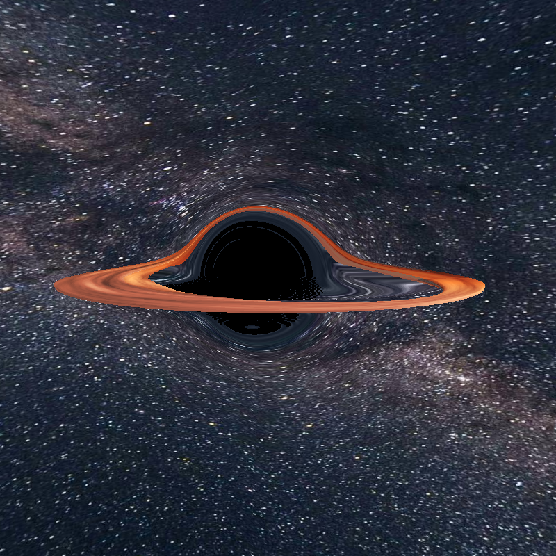

# POINTS

`POINTS` is a library that uses WebGPU and allows you to create shaders without worrying too much about the setup.

# Gallery

https://github.com/user-attachments/assets/e61d8af1-a549-40bc-a790-221a3f8a41c7

# Examples

<div>
    <a href="https://absulit.github.io/points/examples/index.html#bh1">
        
    </a>
    <a href="https://absulit.github.io/points/examples/index.html#mandelbrot1">
        
    </a>
    <a href="https://absulit.github.io/points/examples/index.html#particles4">
        
    </a>
    <a href="https://absulit.github.io/points/examples/index.html#mesh_displace_1">
        
    </a>
</div>
<div>
    <a href="https://absulit.github.io/points/examples/index.html#droste_effect_1">
        
    </a>
    <a href="https://absulit.github.io/points/examples/index.html#mesh_on_mesh_1">
        
    </a>
    <a href="https://absulit.github.io/points/examples/index.html#particles3">
        
    </a>
    <a href="https://absulit.github.io/points/examples/index.html#glb2">
        
    </a>
</div>

All examples are live here: https://absulit.github.io/points/examples/

# Main Audience

The library is for Generative Art, so in general for Creative Coders, for Programmers/Software people who like the arts, and Artists who like to code.

People who just want to create nice live graphics and use mathematics to achieve this.

There's also a strong case for people who wants to create an application that harness the power of a Compute Shader. So a Software Engineer or Mathematician who has to make heavy calculations can do it with this library.

You can code freely without the use of any of the provided [support modules (math, color, image, effects, noise, sdf, etc)](#support-modules) or you can use them and have a little bit less of code in the shader. You can of course create your own modules and import them in the same way.

# Quick Setup
<details>
<summary>A simple one page boilerplate. ( 🔗 click to expand )</summary>

```html
<html>

<head>
    <title>POINTS Quick Setup</title>
</head>

<body>
    <canvas id="canvas" width="800" height="800">
        Oops ... your browser doesn't support the HTML5 canvas element
    </canvas>

    <script type="importmap">
        {
            "imports": {
                "points": "https://cdn.jsdelivr.net/npm/@absulit/points/build/points.min.js"
            }
        }
    </script>

    <script type="module">
        // import the `Points` class
        import Points, { RenderPass } from 'points';

        // reference the canvas in the constructor
        const points = new Points('canvas');

        // create your render pass with three shaders as follow
        const renderPass =
            new RenderPass(/*wgsl*/`
                /**
                 * VertexIn
                 * position: vec4f,
                 * color: vec4f,
                 * uv: vec2f,
                 * normal: vec3f,
                 * id: u32,       // mesh id
                 * vertexIndex: u32,
                 * instanceIndex: u32,
                 */
                @vertex
                fn main(in:VertexIn) -> FragmentIn {
                    return defaultVertexBody(in.position, in.color, in.uv, in.normal);
                }`,
                /*wgsl*/`
                /**
                 * VertexIn
                 * position: vec4f,
                 * color: vec4f,
                 * uv: vec2f,
                 * ratio: vec2f,  // relation between params.screen.x and params.screen.y
                 * uvr: vec2f,    // uv with aspect ratio corrected
                 * mouse: vec2f,
                 * normal: vec3f,
                 * id: u32,       // mesh or instance id
                 * barycentrics: vec3f,
                 */
                @fragment
                fn main(in:FragmentIn) -> @location(0) vec4f {
                    return vec4f(in.uvr, 0, 1);
                }
                `,
                /*wgsl*/`
                // ComputeIn
                // @builtin(global_invocation_id) GID: vec3u,
                // @builtin(workgroup_id)  in.WID: vec3u,
                // @builtin(local_invocation_id) LID: vec3u
                @compute @workgroup_size(8,8,1)
                fn main(in:ComputeIn) {
                    let time = params.time;
                }
                `,
            )


        // call the POINTS init method and then the update method
        await points.init([renderPass]);
        update();

        // call `points.update()` methods to render a new frame
        function update() {
            points.update();
            requestAnimationFrame(update);
        }
    </script>

</body>

</html>

```

</details>


# Documentation

- [Requirements](docs/requirements.md)
    - [A compatible WebGPU browser since it's currently in development](docs/requirements.md#a-compatible-webgpu-browser-since-its-currently-in-development)
    - [Syntax highlight and IDE](docs/requirements.md#syntax-highlight-and-ide)
- [Workflow](docs/workflow.md)
- [API docs](https://absulit.github.io/points/apidocs/index.html)
- [Installation](docs/installation.md)
    - [cdn (importmap)](docs/installation.md#cdn-importmap-code-examples_tutorialcdn)
    - [npm](docs/installation.md#npm-code-examples_tutorialnpm)
    - [bun](docs/installation.md#bun-code-examples_tutorialbun)
- [Steps after installing](docs/steps_after_installing.md)
- [Repository Examples](docs/repository_examples.md)
    - [index.html](docs/repository_examples.md#indexhtml)
    - [main.js](docs/repository_examples.md#mainjs)
- [RenderPass](docs/renderpass.md)
    - [Meshes](docs/renderpass.md#meshes)
    - [Clear or preserve previous RenderPass output](docs/renderpass.md#clear-or-preserve-previous-renderpass-output)
    - [Lines, points, triangles (wireframe)](docs/renderpass.md#lines-points-triangles-wireframe)
    - [Instances](docs/renderpass.md#instances)
- [Using the examples for a custom project](docs/create_your_custom_shader_project.md)
- Data Input and Output
    - [Default data available to read](docs/default_data_to_read.md)
        - [Params Uniform](docs/default_data_to_read.md#params-uniform)
        - [Parameters in vert.js that go to frag.js](docs/default_data_to_read.md#parameters-in-vertjs-that-go-to-fragjs)
            - [vert.js](docs/default_data_to_read.md#vertjs)
            - [frag.js](docs/default_data_to_read.md#fragjs)
    - [Send data into the shaders](docs/send_data_into_the_shaders.md)
        - [Uniforms](docs/send_data_into_the_shaders.md#uniforms---setuniform)
        - [Sampler - setSampler](docs/send_data_into_the_shaders.md#sampler---setsampler)
        - [Texture - setTexture2d](docs/send_data_into_the_shaders.md#texture---settexture2d)
        - [Texture Image - setTextureImage](docs/send_data_into_the_shaders.md#textureimage---settextureimage)
        - [Texture 2d Array - setTextureImageArray](docs/send_data_into_the_shaders.md#texture2darray---settextureimagearray)
        - [Storage - setStorage](docs/send_data_into_the_shaders.md#storage---setstorage)
        - [Storage Map - setStorageMap](docs/send_data_into_the_shaders.md#storagemap---setstoragemap)
        - [Binding Texture - setBindingTexture](docs/send_data_into_the_shaders.md#bindingtexture---setbindingtexture)
        - [Video - setTextureVideo](docs/send_data_into_the_shaders.md#video---settexturevideo)
        - [Webcam - setTextureWebcam](docs/send_data_into_the_shaders.md#webcam---settexturewebcam)
        - [DepthMap - setTextureDepth2d](docs/send_data_into_the_shaders.md#depthmap---settexturedepth2d)
        - [Audio - setAudio](docs/send_data_into_the_shaders.md#audio---setaudio)
    - [Retrieve data from the shaders](docs/retrieve_data_from_the_shaders.md)
        - [Read Storage - readStorage](docs/retrieve_data_from_the_shaders.md#read-storage---readstorage)
        - [Events - addEventListener](docs/retrieve_data_from_the_shaders.md#events---addeventlistener)
- [UV Coordinates and Textures Considerations](docs/uv_coordinates_and_textures_considerations.md)
- [Support Modules](docs/support_modules.md)
    - [How to use them](docs/support_modules.md#how-to-use-them)
- [RenderPasses for Post Processing](docs/render_passes_and_post_processing.md)
- [Legacy folder (original project)](docs/legacy_folder.md)

# Collaborators

[@juulio](https://github.com/juulio)
- Documentation testing
- Verifying installation is understandable
